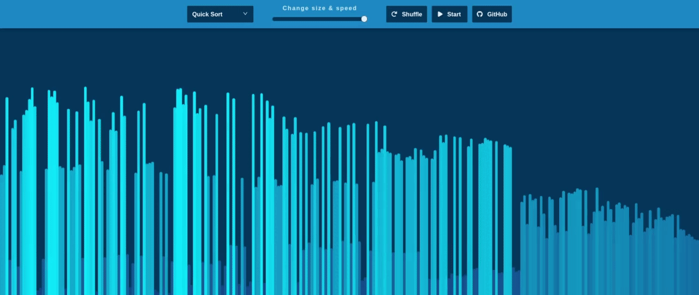

# Sorting visualizer on React

## View project <a href="https://tmneth.github.io/sorting-visualizer/">demo</a> or access it locally

<br/>

```console
git clone https://github.com/tmneth/sorting-visualizer.git
```

```console
cd sorting-visualizer
npm install
npm run start
```

# Features

<ul>
  <li>Control array size & visualization speed</li>
  <li>Select one of the several sorting algorithms</li>
  <li>View color interpolation (gradient creation) in action</li>
</ul>

# Examples




